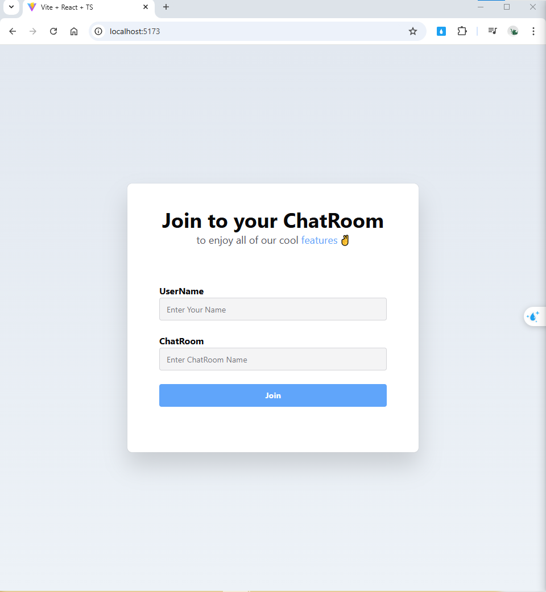
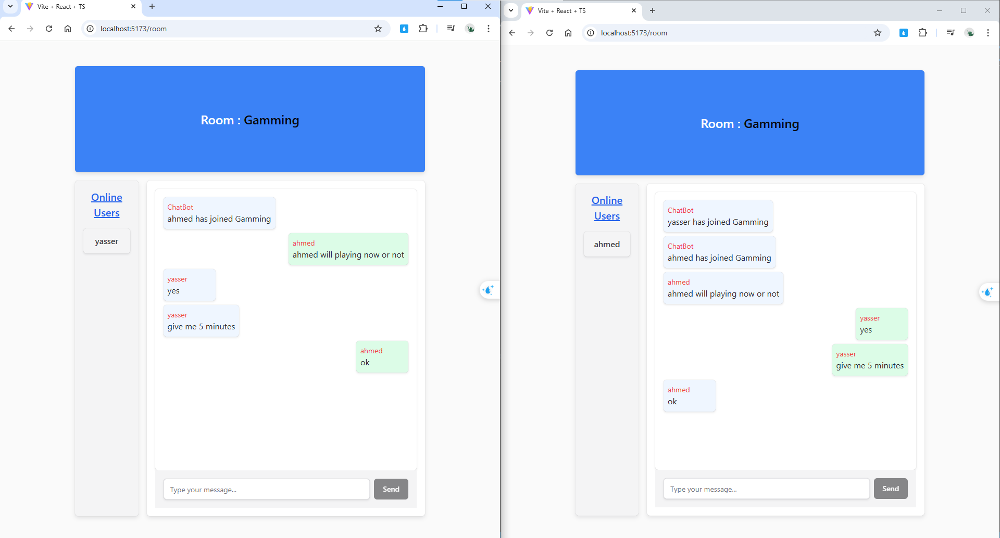

# Chat Room Project

A real-time chat application built using **React** for the frontend and **ASP.NET Core** for the backend. It leverages **SignalR** for real-time communication and **Entity Framework Core** for database operations.

## Features

- **Real-Time Messaging:** Instant updates for chat messages using SignalR.
- **User Authentication:** Secure login and registration.
- **Persistent State:** State management using Redux and persistence with redux-persist.
- **Theming:** Light and dark mode support using next-themes.
- **Responsive Design:** Built with Chakra UI for a fully responsive experience.
- **Database:** SQL Server database for storing user and message data.

---

## Technologies Used

### Frontend:
- **[@chakra-ui/react](https://chakra-ui.com/):** UI components for building modern interfaces.
- **[@reduxjs/toolkit](https://redux-toolkit.js.org/):** State management library.
- **[@microsoft/signalr](https://www.npmjs.com/package/@microsoft/signalr):** SignalR client for real-time communication.
- **[@emotion/react](https://emotion.sh/docs/introduction):** CSS-in-JS library for styling.
- **[next-themes](https://github.com/pacocoursey/next-themes):** Theme switching for React applications.
- **[react-router-dom](https://reactrouter.com/):** Routing for navigation.
- **[redux-persist](https://github.com/rt2zz/redux-persist):** Persisting Redux state across sessions.
- **[framer-motion](https://www.framer.com/motion/):** Animation library for React.

### Backend:
- **[ASP.NET Core SignalR](https://learn.microsoft.com/en-us/aspnet/core/signalr):** Real-time web communication framework.
- **[Entity Framework Core](https://learn.microsoft.com/en-us/ef/core):** Object-relational mapper for database operations.
- **SQL Server:** Database for storing user and message data.
---

## Usage

1. Start both the frontend and backend servers.
2. Open your browser and navigate to the frontend URL (e.g., `http://localhost:3000`).
3. Register a new user or log in.
4. Start a chat with other users in real-time.

---

## Acknowledgments
- **Chakra UI** for the awesome component library.
- **SignalR** for seamless real-time communication.
- **Redux Toolkit** for simplifying state management.

